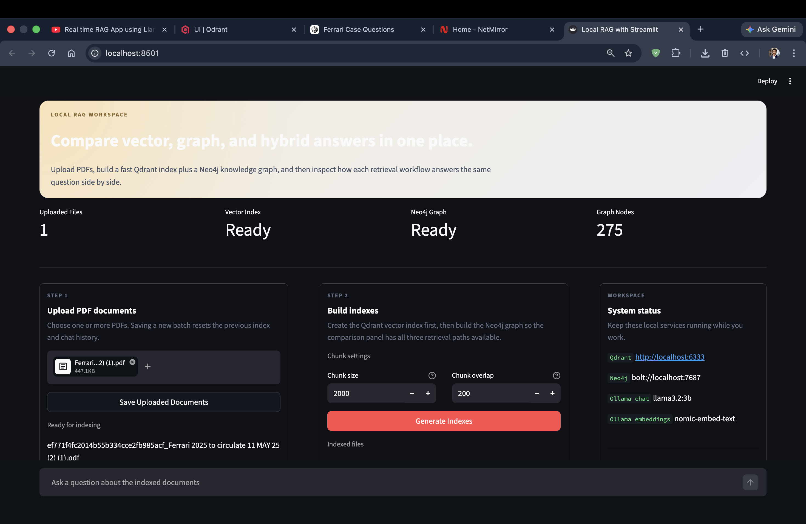
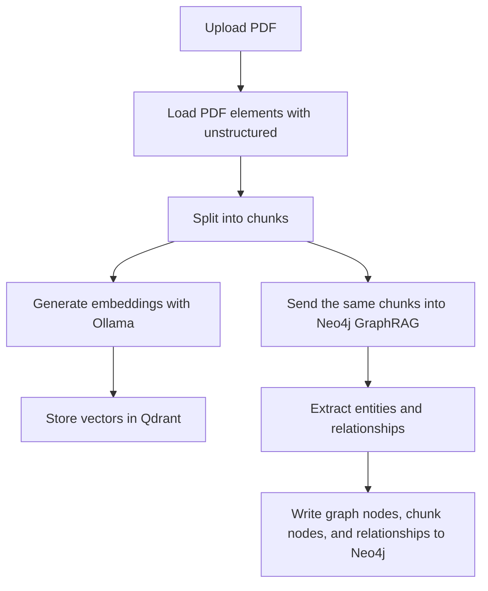
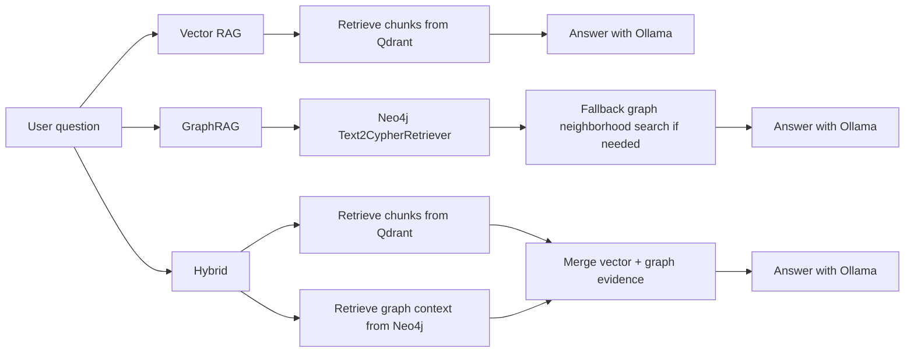

# Local RAG Workspace

A local-first RAG playground built with Streamlit, Qdrant, Neo4j GraphRAG, and Ollama.

This app lets you upload PDF documents, build both a vector index and a knowledge graph, and compare how three retrieval workflows answer the same question:

- `Vector RAG`
- `GraphRAG`
- `Hybrid`

Everything runs locally:

- `Ollama` for chat and embeddings
- `Qdrant` for vector search
- `Neo4j` for graph construction and graph retrieval
- `Streamlit` for the UI

## Demo

[](assets/demo-video.mov)

Click the screenshot above to open the demo video.

- Screenshot: [`assets/demo-screenshot.png`](assets/demo-screenshot.png)
- Demo video: [`assets/demo-video.mov`](assets/demo-video.mov)

## Why This Project Exists

Most RAG demos show only one retrieval strategy. This project is designed to make the tradeoffs visible.

With one uploaded PDF, you can:

- inspect vector retrieval from Qdrant
- inspect graph retrieval from Neo4j
- compare hybrid answers against both
- see the raw evidence used by each workflow
- inspect what was actually written into the knowledge graph

It is useful for learning, experimentation, demos, and debugging GraphRAG behavior on local models.

## Features

- PDF ingestion with `unstructured`
- configurable chunk size and overlap from the Streamlit UI
- local embeddings using `OllamaEmbeddings`
- local vector search with `Qdrant`
- local knowledge graph construction with `neo4j-graphrag`
- local answer generation with `ChatOllama`
- side-by-side `Vector`, `Graph`, and `Hybrid` responses
- workflow evidence panels showing retrieved Qdrant chunks and Neo4j graph context
- Neo4j graph explorer showing labels, relationship counts, and preview edges
- session-state chat history
- app-level logging across upload, indexing, retrieval, and graph workflows
- timeout-aware Neo4j graph indexing that skips stuck chunks instead of freezing the whole run

## Tech Stack

- Python
- Streamlit
- LangChain
- Qdrant
- Neo4j
- neo4j-graphrag
- Ollama
- Docker

## How It Works

### Indexing Flow

When you click `Generate Indexes`, the app performs two indexing passes from the same uploaded content.



Important detail:

- Qdrant and Neo4j now use the same base chunked text from the app pipeline, so graph and vector workflows stay more closely aligned.

### Retrieval Workflows

Each question runs three workflows in parallel.



### Workflow Definitions

#### Vector RAG

- retrieves semantically similar chunks from Qdrant
- sends those chunks to Ollama
- answers using vector context only

#### GraphRAG

- tries Neo4j `Text2CypherRetriever` first
- if no graph context is returned, falls back to deterministic graph neighborhood search
- synthesizes the answer from graph evidence only

#### Hybrid

- retrieves chunks from Qdrant
- retrieves graph context from Neo4j
- merges both context sources into one prompt
- synthesizes a final answer with Ollama

## UI Overview

The app is organized into four areas:

1. `Upload PDF documents`
2. `Build indexes`
3. `Knowledge Graph`
4. `Ask once, compare three answers`

### Build Indexes

The indexing panel lets the user control:

- `Chunk size`
- `Chunk overlap`

This makes it easier to experiment with retrieval quality and graph construction behavior without editing code.

### Knowledge Graph Explorer

After indexing, the app shows:

- graph node count
- relationship count
- chunk node count
- node label distribution
- relationship type distribution
- preview graph edges

This is useful when GraphRAG answers look weak and you need to inspect whether the graph was actually built the way you expected.

### Evidence Panels

Each answer card includes a `Retrieved Evidence` section.

Depending on the workflow, you can inspect:

- Qdrant chunks
- Neo4j graph context lines
- Neo4j edge previews

This makes debugging much easier than looking only at the final answer.

## Project Structure

```text
.
├── assets
│   ├── demo-screenshot.png
│   └── demo-video.mov
├── app.py
├── docker-compose.yml
├── requirements.txt
├── README.md
└── rag_app
    ├── chat.py
    ├── config.py
    ├── document_loader.py
    ├── embeddings.py
    ├── llm.py
    ├── logging_utils.py
    ├── neo4j_graphrag_service.py
    ├── runtime.py
    ├── state.py
    ├── ui.py
    └── vector_store.py
```

## Local Setup

### 1. Create a virtual environment

```bash
python3 -m venv .venv
source .venv/bin/activate
```

### 2. Install dependencies

```bash
pip install --upgrade pip
pip install -r requirements.txt
```

### 3. Start infrastructure services

```bash
docker compose up -d
```

This starts:

- `Qdrant` on `http://localhost:6333`
- `Neo4j Browser` on `http://localhost:7474`
- `Neo4j Bolt` on `bolt://localhost:7687`

### 4. Pull Ollama models

```bash
ollama pull llama3.2:3b
ollama pull nomic-embed-text
```

### 5. Run the app

```bash
streamlit run app.py
```

Open:

- [http://localhost:8501](http://localhost:8501)

## Neo4j Login

By default:

- username: `neo4j`
- password: `password12345`

You can change these via environment variables.

## Configuration

Settings are loaded from [`rag_app/config.py`](rag_app/config.py) and optional `.env` values.

Common variables:

```env
OLLAMA_BASE_URL=http://127.0.0.1:11434
OLLAMA_CHAT_MODEL=llama3.2:3b
OLLAMA_EMBEDDING_MODEL=nomic-embed-text

NEO4J_URI=bolt://localhost:7687
NEO4J_USERNAME=neo4j
NEO4J_PASSWORD=password12345
NEO4J_DATABASE=neo4j
NEO4J_SCHEMA_MODE=FREE

GRAPH_CHUNK_TIMEOUT_SECONDS=60
LOG_LEVEL=INFO
```

## Running the App

1. Upload one or more PDFs.
2. Adjust `Chunk size` and `Chunk overlap`.
3. Click `Save Uploaded Documents`.
4. Click `Generate Indexes`.
5. Wait for:
   - Qdrant indexing
   - Neo4j graph construction
6. Ask a question in the chat box.
7. Compare:
   - `Vector RAG`
   - `GraphRAG`
   - `Hybrid`
8. Open `Retrieved Evidence` to inspect the actual context used.

## Notes on GraphRAG Performance

Neo4j graph building is slower than vector indexing because it involves LLM-based entity and relationship extraction.

Things to keep in mind:

- graph indexing can take noticeably longer than Qdrant indexing
- small local models may produce weaker graph extraction than larger hosted models
- some chunks may be skipped if they time out during graph construction
- the graph workflow can still be useful even when it returns less context than the vector workflow

For development, smaller PDFs and moderate chunk sizes usually make iteration much easier.

## Troubleshooting

### Qdrant port already in use

If Docker reports port `6333` is already allocated, another Qdrant container is probably already running.

Check:

```bash
docker ps --filter publish=6333
```

### Neo4j graph build feels stuck

Possible reasons:

- Ollama is busy or slow
- a chunk is taking too long to extract entities/relations
- the chosen chunk size is too large

What to try:

- reduce chunk size
- test on a smaller PDF first
- increase `GRAPH_CHUNK_TIMEOUT_SECONDS` if your machine is slow
- confirm Ollama is healthy and the model is pulled

### GraphRAG returns weak results

Use the UI to check:

- the `Knowledge Graph` section
- the `Retrieved Evidence` expander in the graph card

If Neo4j has very little graph content, the issue is likely in graph construction. If the graph exists but retrieval is weak, the issue is more likely query generation or sparse graph matches.

### Dependency conflicts in the virtual environment

If your environment has old LangChain or GraphRAG packages left over, recreate the virtual environment:

```bash
rm -rf .venv
python3 -m venv .venv
source .venv/bin/activate
pip install --upgrade pip
pip install -r requirements.txt
```

## Current Limitations

- GraphRAG quality depends heavily on the local Ollama model
- Neo4j graph indexing is slower than vector-only indexing
- graph extraction may skip difficult chunks when timeouts occur
- retrieval quality can vary significantly with chunk size
- this project is optimized for experimentation rather than production hardening

## Future Improvements

- background graph indexing
- graph visualization with interactive nodes and edges
- persistent workflow history
- richer source attribution per answer
- incremental graph rebuilds instead of full rebuilds

